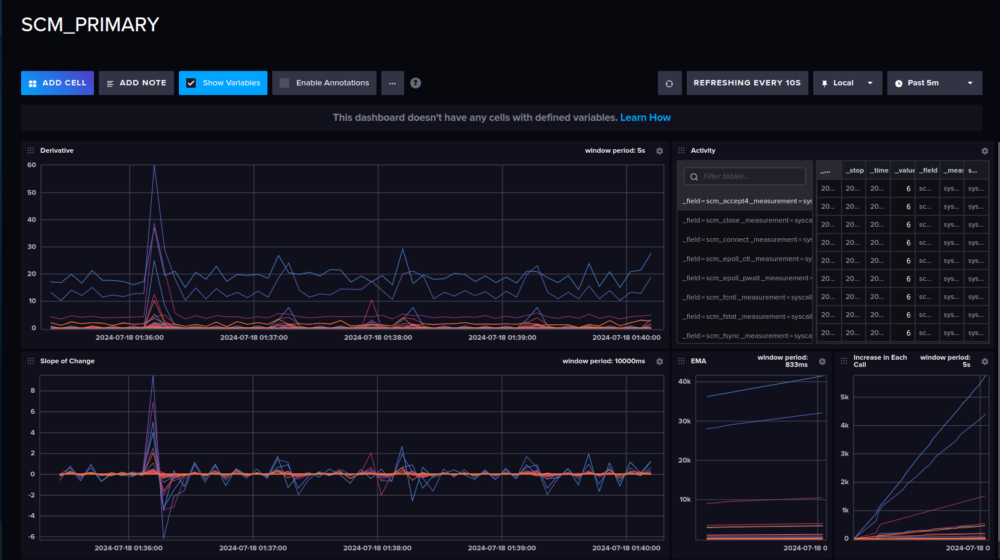

## Introduction
This repository containes dashboards for visualizing the oncoming kernel data.

## InfluxDB
#### Steps:
1. Provision the docker container using the provided [dockerfile](https://github.com/scm-probe/scm-prom/blob/5709cc4e24a60bec3aabf394a79cc2a47a049624/monitor.docker-compose.yaml#L1)
2. Login to ui at `http://localhost:8086/` with credentials in the dockerfile environment variables.
3. Go to dashboards and import the provided [json](./influx/scm_primary.json)

